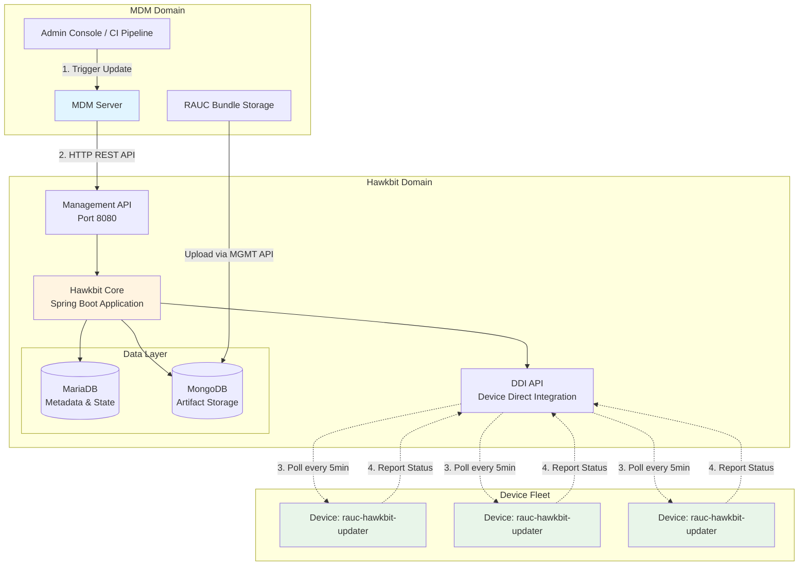
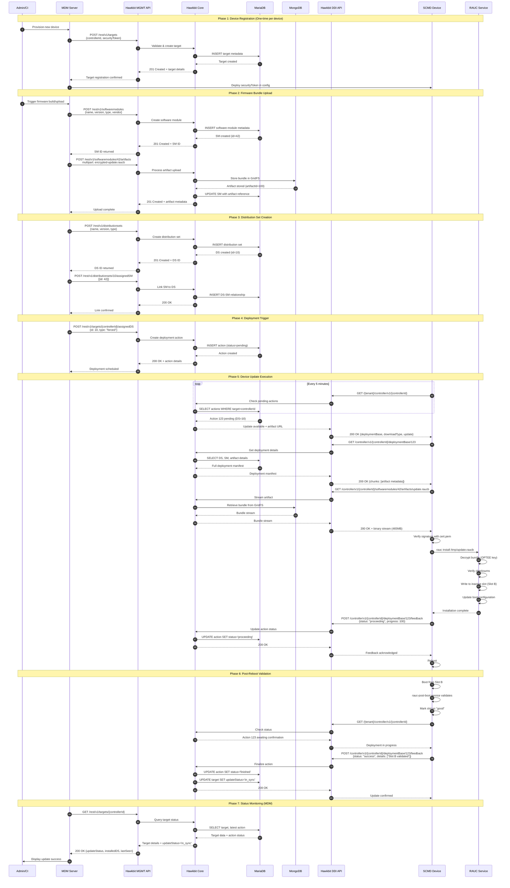

# MDM to Hawkbit Integration Guide

## Document Overview

This document defines the integration between the MDM Server and Hawkbit FOTA system for RAUC-based firmware updates on SCMD devices.

---

## System Architecture



### Architecture Notes

**MDM Server Responsibilities:**

- Authenticate with Hawkbit Management API
- Register device targets
- Upload RAUC bundles
- Create distribution sets
- Trigger deployments (single device or fleet-wide rollouts)
- Monitor update status

**Hawkbit Core Responsibilities:**

- Store device metadata and firmware artifacts
- Manage update assignments and rollout campaigns
- Serve DDI API for device polling
- Track deployment status and history

**Device Responsibilities:**

- Poll Hawkbit DDI API for pending updates
- Download and verify RAUC bundles
- Install updates using RAUC service
- Report installation status back to Hawkbit

**Network Configuration:**

- MDM to Hawkbit: HTTPS REST API
- Device to Hawkbit: HTTPS DDI API
- No message brokers (RabbitMQ/Redis) required for this deployment

---

## Complete Update Flow Sequence



---

## API Reference for MDM Integration

### Base Configuration

```text
Base URL:     https://hawkbitIP.com:8080
Tenant:       DEFAULT
Auth Method:  HTTP Basic Authentication
Content-Type: application/json (except file uploads)
```

### API Authentication

All Management API requests require HTTP Basic Authentication:

```http
Authorization: Basic <base64(username:password)>
```

Example:

```bash
# Username: admin, Password: admin
Authorization: Basic YWRtaW46YWRtaW4=
```

---

## API Endpoints

### 1. System Configuration

#### 1.1 Enable Target Token Authentication

**Purpose:** Configure Hawkbit to accept device authentication via security tokens.

**Endpoint:** `PUT /rest/v1/system/configs/authentication.targettoken.enabled`

**Request:**

```json
{
  "value": true
}
```

**Response:**

```json
{
  "value": true,
  "global": false,
  "lastModifiedAt": 1699267200000,
  "lastModifiedBy": "admin",
  "createdAt": 1699267200000,
  "createdBy": "admin"
}
```

**Call Frequency:** Once during initial setup

---

#### 1.2 Set Device Polling Interval

**Purpose:** Configure how often devices check for updates.

**Endpoint:** `PUT /rest/v1/system/configs/pollingTime`

**Request:**

```json
{
  "value": "00:05:00"
}
```

**Format:** `HH:MM:SS` (e.g., "00:05:00" = 5 minutes)

**Response:**

```json
{
  "value": "00:05:00",
  "global": false,
  "lastModifiedAt": 1699267200000,
  "lastModifiedBy": "admin"
}
```

**Recommended Values:**

- Development: 00:00:30 (30 seconds)
- Production: 00:05:00 (5 minutes)

---

### 2. Target Management

#### 2.1 Register Device Target

**Purpose:** Register a new device in Hawkbit system.

**Endpoint:** `POST /rest/v1/targets`

**Request:**

```json
[
  {
    "controllerId": "device-00112233",
    "name": "SCMD Production Device 001",
    "securityToken": "TII-MDM-PoC-token-test-007",
    "requestAttributes": true
  }
]
```

**Field Descriptions:**

- `controllerId`: Unique device identifier (e.g., MAC address, serial number). Required.
- `name`: Human-readable device name. Optional.
- `securityToken`: Authentication token device will use for DDI API. Required.
- `requestAttributes`: Request device to send attributes on next poll. Recommended: true.

**Response:**

```json
[
  {
    "createdBy": "admin",
    "createdAt": 1699267200000,
    "lastModifiedBy": "admin",
    "lastModifiedAt": 1699267200000,
    "name": "SCMD Production Device 001",
    "controllerId": "device-00112233",
    "updateStatus": "unknown",
    "securityToken": "TII-MDM-PoC-token-test-007",
    "requestAttributes": true,
    "_links": {
      "self": {
        "href": "https://hawkbitIP.com:8080/rest/v1/targets/device-00112233"
      }
    }
  }
]
```

**Status Codes:**

- 201: Target created successfully
- 400: Invalid request body
- 409: Target with same controllerId already exists

---

#### 2.2 Query Target Status

**Purpose:** Check device update status and metadata.

**Endpoint:** `GET /rest/v1/targets/{controllerId}`

**Example:** `GET /rest/v1/targets/device-00112233`

**Response:**

```json
{
  "createdBy": "admin",
  "createdAt": 1699267200000,
  "lastModifiedBy": "system",
  "lastModifiedAt": 1699270800000,
  "name": "SCMD Production Device 001",
  "controllerId": "device-00112233",
  "updateStatus": "in_sync",
  "lastControllerRequestAt": 1699270800000,
  "installedDistributionSet": {
    "id": 10,
    "name": "HOS2 Release 2025.11",
    "version": "2025.11.0"
  },
  "securityToken": "TII-MDM-PoC-token-test-007",
  "_links": {
    "self": {
      "href": "https://hawkbitIP.com:8080/rest/v1/targets/device-00112233"
    }
  }
}
```

**Update Status Values:**

- `unknown`: No update attempted yet
- `in_sync`: Device running assigned firmware
- `pending`: Update assigned, waiting for device to poll
- `registered`: Device registered but not polling
- `error`: Update installation failed

**Status Codes:**

- 200: Success
- 404: Target not found

---

### 3. Software Module Management

#### 3.1 Create Software Module

**Purpose:** Create metadata entry for a firmware version.

**Endpoint:** `POST /rest/v1/softwaremodules`

**Request:**

```json
[
  {
    "name": "HOS2 OS",
    "version": "2025.11.0",
    "description": "November 2025 firmware release",
    "type": "os",
    "vendor": "YourCompany"
  }
]
```

**Field Descriptions:**

- `name`: Software module name. Required.
- `version`: Version string (semantic versioning recommended). Required.
- `type`: Module type. Use "os" for full system updates. Required.
- `vendor`: Organization name. Optional.
- `description`: Release notes or description. Optional.

**Response:**

```json
[
  {
    "createdBy": "admin",
    "createdAt": 1699267200000,
    "lastModifiedBy": "admin",
    "lastModifiedAt": 1699267200000,
    "name": "HOS2 OS",
    "version": "2025.11.0",
    "description": "November 2025 firmware release",
    "type": "os",
    "vendor": "YourCompany",
    "id": 42,
    "_links": {
      "self": {
        "href": "https://hawkbitIP.com:8080/rest/v1/softwaremodules/42"
      },
      "artifacts": {
        "href": "https://hawkbitIP.com:8080/rest/v1/softwaremodules/42/artifacts"
      }
    }
  }
]
```

**Status Codes:**

- 201: Software module created
- 400: Invalid request
- 409: Software module with same name+version+type already exists

---

#### 3.2 Upload Artifact (RAUC Bundle)

**Purpose:** Upload the actual firmware binary to a software module.

**Endpoint:** `POST /rest/v1/softwaremodules/{softwareModuleId}/artifacts`

**Request:**

```http
POST /rest/v1/softwaremodules/42/artifacts HTTP/1.1
Content-Type: multipart/form-data; boundary=----WebKitFormBoundary
Authorization: Basic YWRtaW46YWRtaW4=

------WebKitFormBoundary
Content-Disposition: form-data; name="file"; filename="encrypted-update.raucb"
Content-Type: application/octet-stream

<binary data>
------WebKitFormBoundary--
```

**cURL Example:**

```bash
curl -X POST \
  "https://hawkbitIP.com:8080/rest/v1/softwaremodules/42/artifacts" \
  -u "admin:admin" \
  -H "Content-Type: multipart/form-data" \
  -F "file=@/path/to/encrypted-update.raucb;filename=update.raucb"
```

**Response:**

```json
{
  "createdBy": "admin",
  "createdAt": 1699267200000,
  "lastModifiedBy": "admin",
  "lastModifiedAt": 1699267200000,
  "id": 100,
  "hashes": {
    "sha1": "5cfad0d49c8b263dfe2649cc759a8475c5171086",
    "md5": "4b4e5f066be02db75006f88cea5cc02e",
    "sha256": "e5d13ea08e1f6939afa6d051f23045309afc8017a5ebb6137ea8d2212db336e8"
  },
  "providedFilename": "encrypted-update.raucb",
  "size": 465591282,
  "_links": {
    "self": {
      "href": "https://hawkbitIP.com:8080/rest/v1/softwaremodules/42/artifacts/100"
    },
    "download": {
      "href": "https://hawkbitIP.com:8080/rest/v1/softwaremodules/42/artifacts/100/download"
    }
  }
}
```

**Status Codes:**

- 201: Artifact uploaded successfully
- 400: Invalid file or request
- 404: Software module not found
- 413: File too large (check MongoDB GridFS configuration)

**Implementation Notes:**

- Maximum file size depends on MongoDB configuration
- Hawkbit stores artifacts in MongoDB GridFS
- Multiple artifacts can be uploaded to same software module
- SHA256 hash is automatically calculated and stored

---

### 4. Distribution Set Management

#### 4.1 Create Distribution Set

**Purpose:** Create a deployable release that can contain multiple software modules.

**Endpoint:** `POST /rest/v1/distributionsets`

**Request:**

```json
[
  {
    "name": "HOS2 Release 2025.11",
    "version": "2025.11.0-20251106",
    "description": "Production release for November 2025",
    "type": "os"
  }
]
```

**Field Descriptions:**

- `name`: Distribution set name. Required.
- `version`: Version identifier (include build date for uniqueness). Required.
- `type`: Must match software module type. Use "os". Required.
- `description`: Release notes. Optional.

**Response:**

```json
[
  {
    "createdBy": "admin",
    "createdAt": 1699267200000,
    "lastModifiedBy": "admin",
    "lastModifiedAt": 1699267200000,
    "name": "HOS2 Release 2025.11",
    "version": "2025.11.0-20251106",
    "description": "Production release for November 2025",
    "type": "os",
    "id": 10,
    "complete": false,
    "_links": {
      "self": {
        "href": "https://hawkbitIP.com:8080/rest/v1/distributionsets/10"
      },
      "assignedSM": {
        "href": "https://hawkbitIP.com:8080/rest/v1/distributionsets/10/assignedSM"
      }
    }
  }
]
```

**Status Codes:**

- 201: Distribution set created
- 400: Invalid request
- 409: Distribution set with same name+version already exists

**Note:** `complete: false` indicates no software modules assigned yet.

---

#### 4.2 Assign Software Module to Distribution Set

**Purpose:** Link a software module (containing firmware) to a distribution set.

**Endpoint:** `POST /rest/v1/distributionsets/{distributionSetId}/assignedSM`

**Request:**

```json
[
  {
    "id": 42
  }
]
```

**Response:**

```json
{
  "id": 10,
  "name": "HOS2 Release 2025.11",
  "version": "2025.11.0-20251106",
  "modules": [
    {
      "id": 42,
      "name": "HOS2 OS",
      "version": "2025.11.0",
      "type": "os"
    }
  ],
  "complete": true
}
```

**Status Codes:**

- 200: Software module assigned
- 400: Invalid software module ID or type mismatch
- 404: Distribution set not found

**Note:** `complete: true` indicates distribution set is ready for deployment.

---

### 5. Deployment Operations

#### 5.1 Deploy to Single Device

**Purpose:** Assign a distribution set to a specific device.

**Endpoint:** `POST /rest/v1/targets/{controllerId}/assignedDS`

**Request:**

```json
{
  "id": 10,
  "type": "forced"
}
```

**Field Descriptions:**

- `id`: Distribution set ID. Required.
- `type`: Deployment mode. Required.
  - `forced`: Install immediately and reboot automatically
  - `soft`: User can postpone (not implemented in current device firmware)
  - `timeforced`: Install at specific time (requires `forcetime` parameter)

**Response:**

```json
{
  "alreadyAssigned": 0,
  "assignedActions": [
    {
      "id": 123,
      "_links": {
        "self": {
          "href": "https://hawkbitIP.com:8080/rest/v1/targets/device-00112233/actions/123"
        }
      }
    }
  ],
  "total": 1,
  "assigned": 1
}
```

**Status Codes:**

- 200: Deployment assigned
- 400: Invalid distribution set or type
- 404: Target or distribution set not found

**Implementation Notes:**

- Device will receive update on next poll (within polling interval)
- Action ID (123 in example) can be used to track deployment status
- If distribution set already assigned, returns 409 Conflict

---

#### 5.2 Create Fleet Rollout

**Purpose:** Deploy to multiple devices matching filter criteria.

**Endpoint:** `POST /rest/v1/rollouts`

**Request:**

```json
{
  "distributionSetId": 10,
  "targetFilterQuery": "controllerId==device-*",
  "name": "November 2025 Fleet Update",
  "description": "Deploy HOS2 2025.11.0 to all production devices",
  "type": "forced",
  "groups": [
    {
      "name": "Phase 1",
      "targetPercentage": 10,
      "confirmationRequired": false
    },
    {
      "name": "Phase 2",
      "targetPercentage": 90,
      "confirmationRequired": false
    }
  ]
}
```

**Field Descriptions:**

- `distributionSetId`: Distribution set to deploy. Required.
- `targetFilterQuery`: RSQL filter for target selection. Required.
  - `*`: All devices
  - `controllerId==device-*`: Devices with ID starting with "device-"
  - `tag==production`: Devices tagged "production"
- `name`: Rollout campaign name. Required.
- `type`: Deployment mode (forced/soft/timeforced). Required.
- `groups`: Phased rollout configuration. Optional.
  - If omitted, deploys to all devices simultaneously

**Response:**

```json
{
  "id": 5,
  "name": "November 2025 Fleet Update",
  "status": "ready",
  "distributionSetId": 10,
  "targetFilterQuery": "controllerId==device-*",
  "createdBy": "admin",
  "createdAt": 1699267200000,
  "totalTargets": 150,
  "_links": {
    "self": {
      "href": "https://hawkbitIP.com:8080/rest/v1/rollouts/5"
    },
    "start": {
      "href": "https://hawkbitIP.com:8080/rest/v1/rollouts/5/start"
    }
  }
}
```

**Status Codes:**

- 201: Rollout created (status: ready)
- 400: Invalid filter query or configuration
- 404: Distribution set not found

---

#### 5.3 Start Rollout

**Purpose:** Begin executing a created rollout.

**Endpoint:** `POST /rest/v1/rollouts/{rolloutId}/start`

**Request:** Empty body

**Response:**

```json
{
  "id": 5,
  "name": "November 2025 Fleet Update",
  "status": "running",
  "totalTargets": 150,
  "totalTargetsPerStatus": {
    "running": 15,
    "scheduled": 135,
    "finished": 0,
    "error": 0
  }
}
```

**Status Codes:**

- 200: Rollout started
- 400: Rollout already running or completed
- 404: Rollout not found

---

#### 5.4 Query Rollout Status

**Purpose:** Monitor rollout progress.

**Endpoint:** `GET /rest/v1/rollouts/{rolloutId}`

**Response:**

```json
{
  "id": 5,
  "name": "November 2025 Fleet Update",
  "status": "running",
  "distributionSetId": 10,
  "targetFilterQuery": "controllerId==device-*",
  "totalTargets": 150,
  "totalTargetsPerStatus": {
    "running": 45,
    "scheduled": 80,
    "finished": 20,
    "error": 5
  },
  "createdAt": 1699267200000,
  "startedAt": 1699267500000,
  "lastModifiedAt": 1699270800000
}
```

**Status Values:**

- `ready`: Created but not started
- `running`: Deployment in progress
- `finished`: All devices processed
- `paused`: Manually paused (requires management API call)

---

### 6. Status Monitoring

#### 6.1 Query Action Status

**Purpose:** Get detailed status of specific deployment action.

**Endpoint:** `GET /rest/v1/targets/{controllerId}/actions/{actionId}`

**Example:** `GET /rest/v1/targets/device-00112233/actions/123`

**Response:**

```json
{
  "id": 123,
  "type": "update",
  "status": "finished",
  "detailStatus": "success",
  "distributionSet": {
    "id": 10,
    "name": "HOS2 Release 2025.11",
    "version": "2025.11.0-20251106"
  },
  "createdAt": 1699267200000,
  "lastModifiedAt": 1699270800000,
  "lastStatusCode": 200,
  "messages": [
    "Installation proceeding: 100%",
    "Reboot initiated",
    "Slot B validated successfully"
  ],
  "_links": {
    "self": {
      "href": "https://hawkbitIP.com:8080/rest/v1/targets/device-00112233/actions/123"
    }
  }
}
```

**Status Values:**

- `pending`: Assigned, waiting for device poll
- `running`: Device downloading/installing
- `finished`: Completed (check detailStatus for success/failure)
- `canceling`: Cancellation requested
- `canceled`: Deployment canceled

**Detail Status Values:**

- `success`: Installation successful
- `failure`: Installation failed
- `none`: Status not yet reported

---

## Implementation Examples

### Python Implementation

```python
import requests
import json
from pathlib import Path
from typing import Dict, List, Optional

class HawkbitClient:
    """
    Hawkbit Management API Client for MDM Server Integration
    """
    
    def __init__(self, base_url: str, username: str, password: str):
        """
        Initialize Hawkbit client.
        
        Args:
            base_url: Hawkbit server URL (e.g., https://hawkbit.internal:8080)
            username: Management API username
            password: Management API password
        """
        self.base_url = base_url.rstrip('/')
        self.auth = (username, password)
        self.session = requests.Session()
        self.session.auth = self.auth
        
    def _request(self, method: str, endpoint: str, 
                 json_data: Optional[Dict] = None,
                 files: Optional[Dict] = None) -> Dict:
        """
        Internal method for HTTP requests.
        
        Args:
            method: HTTP method (GET, POST, PUT, DELETE)
            endpoint: API endpoint path
            json_data: Request body as dict
            files: Multipart file upload dict
            
        Returns:
            Response JSON as dict
            
        Raises:
            requests.HTTPError: On HTTP error status
        """
        url = f"{self.base_url}/rest/v1/{endpoint}"
        
        if files:
            response = self.session.request(method, url, files=files)
        else:
            headers = {'Content-Type': 'application/json'} if json_data else {}
            response = self.session.request(
                method, url,
                headers=headers,
                data=json.dumps(json_data) if json_data else None
            )
        
        response.raise_for_status()
        return response.json() if response.content else {}
    
    # Device Management
    
    def register_target(self, controller_id: str, security_token: str,
                       name: Optional[str] = None) -> Dict:
        """
        Register a new device target.
        
        Args:
            controller_id: Unique device identifier
            security_token: Authentication token for device
            name: Human-readable device name (defaults to controller_id)
            
        Returns:
            Created target metadata
        """
        payload = [{
            "controllerId": controller_id,
            "name": name or controller_id,
            "securityToken": security_token,
            "requestAttributes": True
        }]
        result = self._request('POST', 'targets', json_data=payload)
        return result[0]
    
    def get_target_status(self, controller_id: str) -> Dict:
        """
        Query device status and metadata.
        
        Args:
            controller_id: Device identifier
            
        Returns:
            Target status including updateStatus and installedDistributionSet
        """
        return self._request('GET', f'targets/{controller_id}')
    
    # Software Module Management
    
    def create_software_module(self, name: str, version: str,
                               module_type: str = "os",
                               vendor: str = "YourCompany",
                               description: str = "") -> int:
        """
        Create software module metadata.
        
        Args:
            name: Software module name
            version: Version string
            module_type: Module type (use "os" for full system)
            vendor: Vendor name
            description: Module description
            
        Returns:
            Software module ID
        """
        payload = [{
            "name": name,
            "version": version,
            "type": module_type,
            "vendor": vendor,
            "description": description
        }]
        result = self._request('POST', 'softwaremodules', json_data=payload)
        return result[0]['id']
    
    def upload_artifact(self, software_module_id: int,
                       file_path: str) -> Dict:
        """
        Upload RAUC bundle to software module.
        
        Args:
            software_module_id: Target software module ID
            file_path: Path to RAUC bundle file
            
        Returns:
            Artifact metadata including hashes and size
        """
        file_name = Path(file_path).name
        with open(file_path, 'rb') as f:
            files = {
                'file': (file_name, f, 'application/octet-stream')
            }
            return self._request(
                'POST',
                f'softwaremodules/{software_module_id}/artifacts',
                files=files
            )
    
    # Distribution Set Management
    
    def create_distribution_set(self, name: str, version: str,
                               ds_type: str = "os",
                               description: str = "") -> int:
        """
        Create distribution set.
        
        Args:
            name: Distribution set name
            version: Version identifier
            ds_type: Distribution type (must match software module type)
            description: Release notes
            
        Returns:
            Distribution set ID
        """
        payload = [{
            "name": name,
            "version": version,
            "type": ds_type,
            "description": description
        }]
        result = self._request('POST', 'distributionsets', json_data=payload)
        return result[0]['id']
    
    def assign_software_module(self, distribution_set_id: int,
                               software_module_id: int) -> Dict:
        """
        Link software module to distribution set.
        
        Args:
            distribution_set_id: Target distribution set
            software_module_id: Software module to assign
            
        Returns:
            Updated distribution set metadata
        """
        payload = [{"id": software_module_id}]
        return self._request(
            'POST',
            f'distributionsets/{distribution_set_id}/assignedSM',
            json_data=payload
        )
    
    # Deployment Operations
    
    def deploy_to_target(self, controller_id: str,
                        distribution_set_id: int,
                        deployment_type: str = "forced") -> Dict:
        """
        Deploy distribution set to single device.
        
        Args:
            controller_id: Target device identifier
            distribution_set_id: Distribution set to deploy
            deployment_type: Deployment mode (forced/soft/timeforced)
            
        Returns:
            Assignment result with action ID
        """
        payload = {
            "id": distribution_set_id,
            "type": deployment_type
        }
        return self._request(
            'POST',
            f'targets/{controller_id}/assignedDS',
            json_data=payload
        )
    
    def create_rollout(self, distribution_set_id: int,
                      name: str,
                      target_filter: str = "*",
                      deployment_type: str = "forced",
                      groups: Optional[List[Dict]] = None) -> int:
        """
        Create fleet-wide rollout campaign.
        
        Args:
            distribution_set_id: Distribution set to deploy
            name: Rollout campaign name
            target_filter: RSQL filter query (default: all devices)
            deployment_type: Deployment mode
            groups: Phased rollout configuration
            
        Returns:
            Rollout ID
        """
        payload = {
            "distributionSetId": distribution_set_id,
            "targetFilterQuery": target_filter,
            "name": name,
            "type": deployment_type
        }
        if groups:
            payload["groups"] = groups
            
        result = self._request('POST', 'rollouts', json_data=payload)
        return result['id']
    
    def start_rollout(self, rollout_id: int) -> Dict:
        """
        Start executing rollout campaign.
        
        Args:
            rollout_id: Rollout to start
            
        Returns:
            Rollout status
        """
        return self._request('POST', f'rollouts/{rollout_id}/start')
    
    def get_rollout_status(self, rollout_id: int) -> Dict:
        """
        Query rollout progress.
        
        Args:
            rollout_id: Rollout identifier
            
        Returns:
            Rollout status with target counts per state
        """
        return self._request('GET', f'rollouts/{rollout_id}')
    
    # Monitoring
    
    def get_action_status(self, controller_id: str, action_id: int) -> Dict:
        """
        Get detailed deployment action status.
        
        Args:
            controller_id: Device identifier
            action_id: Action identifier
            
        Returns:
            Action status with messages and timestamps
        """
        return self._request(
            'GET',
            f'targets/{controller_id}/actions/{action_id}'
        )


# Usage Example
if __name__ == "__main__":
    # Initialize client
    client = HawkbitClient(
        base_url="https://hawkbitIP.com:8080",
        username="admin",
        password="admin"
    )
    
    # Scenario: Deploy firmware update to device
    
    # Step 1: Register device (one-time)
    target = client.register_target(
        controller_id="device-00112233",
        security_token="secure-token-xyz789",
        name="Production Device 001"
    )
    print(f"Registered: {target['controllerId']}")
    
    # Step 2: Create software module
    sm_id = client.create_software_module(
        name="HOS2 Firmware",
        version="2025.11.0",
        description="November 2025 production release"
    )
    print(f"Software Module ID: {sm_id}")
    
    # Step 3: Upload RAUC bundle
    artifact = client.upload_artifact(
        software_module_id=sm_id,
        file_path="/builds/encrypted-update.raucb"
    )
    print(f"Uploaded: {artifact['size']} bytes, SHA256: {artifact['hashes']['sha256']}")
    
    # Step 4: Create distribution set
    ds_id = client.create_distribution_set(
        name="HOS2 November Release",
        version="2025.11.0-20251106",
        description="Production deployment"
    )
    print(f"Distribution Set ID: {ds_id}")
    
    # Step 5: Link software module to distribution
    client.assign_software_module(
        distribution_set_id=ds_id,
        software_module_id=sm_id
    )
    print("Software module assigned to distribution set")
    
    # Step 6: Deploy to device
    deployment = client.deploy_to_target(
        controller_id="device-00112233",
        distribution_set_id=ds_id,
        deployment_type="forced"
    )
    action_id = deployment['assignedActions'][0]['id']
    print(f"Deployment triggered: Action ID {action_id}")
    
    # Step 7: Monitor status
    import time
    time.sleep(30)  # Wait for device to poll
    
    status = client.get_target_status("device-00112233")
    print(f"Device status: {status['updateStatus']}")
    
    action = client.get_action_status("device-00112233", action_id)
    print(f"Action status: {action['status']} - {action['detailStatus']}")
```

### Bash Implementation

```bash
#!/bin/bash

# Hawkbit API Configuration
HAWKBIT_URL="https://hawkbitIP.com:8080"
AUTH="admin:admin"

# Helper functions
api_post() {
    local endpoint=$1
    local data=$2
    curl -s -u "$AUTH" \
         -H "Content-Type: application/json" \
         -X POST \
         -d "$data" \
         "${HAWKBIT_URL}/rest/v1/${endpoint}"
}

api_get() {
    local endpoint=$1
    curl -s -u "$AUTH" \
         -H "Accept: application/json" \
         "${HAWKBIT_URL}/rest/v1/${endpoint}"
}

api_upload() {
    local endpoint=$1
    local file_path=$2
    curl -s -u "$AUTH" \
         -H "Content-Type: multipart/form-data" \
         -X POST \
         -F "file=@${file_path}" \
         "${HAWKBIT_URL}/rest/v1/${endpoint}"
}

# Usage Example
main() {
    echo "=== Hawkbit Deployment Script ==="
    
    # Register device
    echo "Step 1: Registering device..."
    REGISTER_DATA='[{
        "controllerId": "device-00112233",
        "name": "Production Device 001",
        "securityToken": "secure-token-xyz789",
        "requestAttributes": true
    }]'
    api_post "targets" "$REGISTER_DATA" | jq .
    
    # Create software module
    echo "Step 2: Creating software module..."
    SM_DATA='[{
        "name": "HOS2 Firmware",
        "version": "2025.11.0",
        "type": "os",
        "vendor": "YourCompany",
        "description": "November release"
    }]'
    SM_ID=$(api_post "softwaremodules" "$SM_DATA" | jq -r '.[0].id')
    echo "Software Module ID: $SM_ID"
    
    # Upload artifact
    echo "Step 3: Uploading RAUC bundle..."
    api_upload "softwaremodules/${SM_ID}/artifacts" "/path/to/update.raucb" | jq .
    
    # Create distribution set
    echo "Step 4: Creating distribution set..."
    DS_DATA='[{
        "name": "HOS2 November Release",
        "version": "2025.11.0-20251106",
        "type": "os",
        "description": "Production deployment"
    }]'
    DS_ID=$(api_post "distributionsets" "$DS_DATA" | jq -r '.[0].id')
    echo "Distribution Set ID: $DS_ID"
    
    # Assign software module
    echo "Step 5: Assigning software module to distribution..."
    api_post "distributionsets/${DS_ID}/assignedSM" "[{\"id\": ${SM_ID}}]" | jq .
    
    # Deploy to device
    echo "Step 6: Deploying to device..."
    DEPLOY_DATA="{
        \"id\": ${DS_ID},
        \"type\": \"forced\"
    }"
    api_post "targets/device-00112233/assignedDS" "$DEPLOY_DATA" | jq .
    
    # Check status
    echo "Step 7: Checking device status..."
    sleep 30
    api_get "targets/device-00112233" | jq '{updateStatus, lastControllerRequestAt, installedDistributionSet}'
}

main
```

---

## Error Handling

### Common HTTP Status Codes

| Code | Meaning | Common Causes |
|------|---------|---------------|
| 200 | OK | Request successful |
| 201 | Created | Resource created successfully |
| 400 | Bad Request | Invalid JSON, missing required fields, type mismatch |
| 401 | Unauthorized | Invalid credentials |
| 403 | Forbidden | Insufficient permissions |
| 404 | Not Found | Resource (target/DS/SM) does not exist |
| 409 | Conflict | Resource already exists or state conflict |
| 413 | Payload Too Large | Artifact exceeds size limit |
| 500 | Internal Server Error | Server-side error, check logs |

### Error Response Format

```json
{
  "timestamp": 1699267200000,
  "status": 400,
  "error": "Bad Request",
  "message": "Validation failed: Field 'controllerId' is required",
  "path": "/rest/v1/targets"
}
```

### Recommended Error Handling Strategy

```python
import requests
import time
from typing import Optional

def api_request_with_retry(func, max_retries: int = 3, 
                          backoff: float = 2.0):
    """
    Execute API request with exponential backoff retry.
    
    Args:
        func: Function to execute (must raise requests.HTTPError on failure)
        max_retries: Maximum number of retry attempts
        backoff: Backoff multiplier (seconds)
        
    Returns:
        Function result
        
    Raises:
        requests.HTTPError: After all retries exhausted
    """
    for attempt in range(max_retries):
        try:
            return func()
        except requests.HTTPError as e:
            status_code = e.response.status_code
            
            # Don't retry client errors (400-499) except 429 Too Many Requests
            if 400 <= status_code < 500 and status_code != 429:
                raise
            
            # Don't retry on last attempt
            if attempt == max_retries - 1:
                raise
            
            # Calculate backoff delay
            delay = backoff ** attempt
            print(f"Request failed (HTTP {status_code}), "
                  f"retrying in {delay}s... (attempt {attempt + 1}/{max_retries})")
            time.sleep(delay)
    
    raise RuntimeError("Max retries exceeded")

# Usage
try:
    result = api_request_with_retry(
        lambda: client.deploy_to_target("device-001", ds_id)
    )
except requests.HTTPError as e:
    print(f"Deployment failed: {e.response.status_code} - {e.response.text}")
```

---

## Security Considerations

### Authentication Methods

**Current Implementation:**

- HTTP Basic Authentication (username + password)
- Credentials transmitted in Authorization header
- Base64 encoded (NOT encrypted)

**Production Requirements:**

- Use HTTPS/TLS for all API communication
- Rotate credentials regularly
- Consider OAuth2/JWT for enhanced security
- Implement rate limiting on MDM server side

### Device Authentication

**Device-to-Hawkbit:**

- Devices authenticate using `securityToken` in HTTP header
- Token format: `Authorization: TargetToken {securityToken}`
- Tokens should be unique per device
- Store tokens securely in device configuration

### Bundle Security

**RAUC Bundle Security:**

- Bundles are signed with HSM-stored keys (SRK root cert chain)
- Bundles are encrypted for target device(s) using device-specific OPTEE keys
- Devices verify signature before installation
- Certificate chain: SRK-CERT.pem → RAUC.pem

**Certificate Deployment:**

- Root certificate (SRK-CERT.pem) must be deployed to device at `/data/rauc/cert.pem`
- Device decryption key stored in OPTEE secure storage
- Key provisioning happens during device manufacturing/initialization

---

## Performance Considerations

### Bundle Upload Optimization

**Large File Uploads:**

- RAUC bundles typically 400-500 MB
- Upload time depends on network bandwidth
- Hawkbit stores artifacts in MongoDB GridFS (default chunk size: 255 KB)
- Consider compressing bundles (RAUC supports SquashFS compression)

**Recommendations:**

- Upload during off-peak hours
- Implement chunked upload with resume capability for unreliable networks
- Monitor MongoDB disk space (artifacts are stored permanently unless manually deleted)

### Device Polling

**Default Configuration:**

- Polling interval: 5 minutes
- Each poll: ~1 KB HTTP request/response (if no update available)
- With update: Large binary download (400-500 MB)

**Scaling Considerations:**

- 1000 devices: ~200 requests/minute to Hawkbit
- Network bandwidth for simultaneous updates: Plan accordingly
- Hawkbit handles concurrent device connections well
- Consider phased rollouts for large fleets (e.g., 10% → 90%)

### Database Sizing

**MariaDB:**

- Stores metadata only (targets, actions, status)
- Typical size: <100 MB per 1000 devices with 10 firmware versions
- Requires regular backups (contains deployment history)

**MongoDB:**

- Stores firmware artifacts (GridFS)
- Size: (number of firmware versions) × (bundle size)
- Example: 10 versions × 450 MB = 4.5 GB
- Disk space planning critical

---

## Troubleshooting Guide

### Issue: Device Not Polling

**Symptoms:**

- `lastControllerRequestAt` not updating
- Device updateStatus remains "unknown" or "registered"

**Diagnostic Steps:**

1. Verify device network connectivity to Hawkbit server
2. Check device `rauc-hawkbit-updater.service` status:

   ```bash
   systemctl status rauc-hawkbit-updater.service
   journalctl -u rauc-hawkbit-updater.service -f
   ```

3. Verify device configuration:
   - Hawkbit URL configured correctly
   - `controllerId` matches registration
   - `securityToken` matches server-side value
4. Check Hawkbit server logs for authentication failures

**Resolution:**

- Correct device configuration at `/etc/rauc-hawkbit-updater/config.conf`
- Restart updater service: `systemctl restart rauc-hawkbit-updater.service`

---

### Issue: Update Not Starting on Device

**Symptoms:**

- updateStatus shows "pending"
- Device polling successfully
- No installation progress

**Diagnostic Steps:**

1. Verify distribution set is complete (has assigned software module)
2. Check action status via API: GET `/rest/v1/targets/{id}/actions/{actionId}`
3. Review device logs during polling:

   ```bash
   journalctl -u rauc-hawkbit-updater.service -n 100
   ```

4. Verify device has sufficient disk space

**Common Causes:**

- Incomplete distribution set (no software module assigned)
- Device already has assigned distribution set installed
- Network issues during bundle download

---

### Issue: Installation Failure

**Symptoms:**

- updateStatus shows "error"
- Device reports failure in action feedback
- System rolled back to previous slot

**Diagnostic Steps:**

1. Check device RAUC logs:

   ```bash
   journalctl -u rauc.service -n 200
   journalctl -u rauc-post-boot.service
   ```

2. Verify bundle signature:

   ```bash
   rauc info --keyring /data/rauc/cert.pem /path/to/bundle.raucb
   ```

3. Check available disk space on device
4. Review U-Boot environment:

   ```bash
   fw_printenv BOOT_ORDER
   fw_printenv BOOT_A_LEFT
   fw_printenv BOOT_B_LEFT
   ```

**Common Causes:**

- Bundle signature verification failed (wrong certificate)
- Insufficient disk space for installation
- Corrupted bundle download
- Hardware failure (eMMC issues)

---

### Issue: Bundle Upload Failure

**Symptoms:**

- HTTP 413 Payload Too Large
- Upload timeout
- HTTP 500 Internal Server Error during upload

**Diagnostic Steps:**

1. Check bundle file size: `ls -lh update.raucb`
2. Verify MongoDB GridFS configuration (max file size)
3. Check Hawkbit server logs for errors
4. Verify network stability during upload

**Resolution:**

- Increase MongoDB GridFS chunk size if needed
- Configure HTTP proxy/load balancer timeouts for large uploads
- Implement upload retry logic in MDM client

---

### Issue: Rollout Stuck

**Symptoms:**

- Rollout status remains "running"
- Some devices never receive update
- totalTargetsPerStatus counts not changing

**Diagnostic Steps:**

1. Query rollout status: GET `/rest/v1/rollouts/{id}`
2. Check individual target status for devices in "scheduled" state
3. Review rollout group configuration (if phased)
4. Check for failed devices blocking group progression

**Resolution:**

- Manually trigger devices that didn't receive update
- Pause and resume rollout
- Cancel and recreate rollout if necessary

---

## Appendix A: RSQL Filter Query Reference

Hawkbit uses RSQL (RESTful Service Query Language) for target filtering in rollouts.

### Basic Syntax

```text
field==value           # Equals
field!=value           # Not equals
field=in=(val1,val2)   # In list
field=out=(val1,val2)  # Not in list
field=like=pattern     # Pattern matching (* and ? wildcards)
```

### Logical Operators

```text
;    # AND
,    # OR
```

### Examples

```text
controllerId==device-001                    # Single device
controllerId==device-*                      # Pattern match (all devices starting with "device-")
tag==production                             # Devices tagged "production"
tag==production;controllerId==device-*      # Production devices with specific ID pattern
updateStatus!=in_sync                       # Devices not up to date
name=like=*Building-A*                      # Devices with "Building-A" in name
tag==production,tag==staging                # Devices tagged production OR staging
```

### Common Use Cases

**Deploy to all devices:**

```text
*
```

**Deploy to specific datacenter:**

```text
tag==datacenter-us-east
```

**Deploy to devices running old firmware:**

```text
updateStatus!=in_sync;tag==production
```

**Exclude specific devices:**

```text
controllerId!=device-001;controllerId!=device-002
```

---

## Appendix B: API Quick Reference

### Base URLs

```text
Management API:  {base_url}/rest/v1/*
DDI API:         {base_url}/{tenant}/controller/v1/*  (used by devices)
```

### Essential Endpoints

| Operation | Method | Endpoint |
|-----------|--------|----------|
| Register device | POST | `/rest/v1/targets` |
| Create software module | POST | `/rest/v1/softwaremodules` |
| Upload artifact | POST | `/rest/v1/softwaremodules/{id}/artifacts` |
| Create distribution set | POST | `/rest/v1/distributionsets` |
| Assign SM to DS | POST | `/rest/v1/distributionsets/{id}/assignedSM` |
| Deploy to device | POST | `/rest/v1/targets/{id}/assignedDS` |
| Create rollout | POST | `/rest/v1/rollouts` |
| Start rollout | POST | `/rest/v1/rollouts/{id}/start` |
| Query target status | GET | `/rest/v1/targets/{id}` |
| Query rollout status | GET | `/rest/v1/rollouts/{id}` |
| Query action details | GET | `/rest/v1/targets/{id}/actions/{actionId}` |

### Authentication Header Format

```http
Authorization: Basic <base64(username:password)>
```

### Content Types

```text
JSON requests:          Content-Type: application/json
File uploads:           Content-Type: multipart/form-data
Responses:              Content-Type: application/hal+json
```

---
